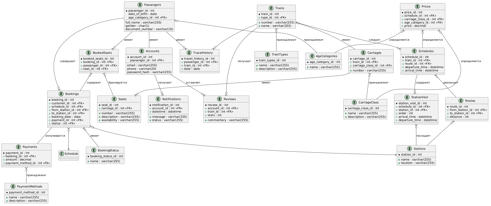

# Система заказа билетов железнодорожного вокзала
Задача: спроектировать реляционную базу данных для обслуживания продажи билетов на поезда.

## Функциональные требования
- Система должна позволять пользователям регистрироваться, указав адрес электронной почты (или номер телефона), имя пользователя и пароль
- Пользователи должны иметь возможность просматривать доступные поезда по выбранному месту отправления, месту назначения и дате поездки
- Система должна хранить информацию о станциях, включая их название и местоположение
- Система должна хранить информацию о поездах, включая наименование, тип, количество вагонов, количество мест
- Система должна хранить информацию о вагонах поезда, включая информацию о количестве мест и классе
- Система должна хранить информацию о местах, включая их номер и доступность
- Система должна хранить расписание поездов
- В расписании должно быть указано время прибытия и отправления для каждой станции, а также порядок посещения станций
- Пользователи должны иметь возможность бронировать билеты на выбранные поезда
- Пользователи должны иметь возможность просматривать историю своих покупок
- Система должна поддерживать различные типы вагонов и взрослый/детский тип билетов
- Пользователи должны иметь возможность забронировать места для нескольких человек в одном заказе
- Билеты должны иметь различные цены в зависимости от выбранного расписания и типа вагона
- Система должна поддерживать различные методы оплаты
- Пользователи должны иметь возможность оставить отзыв на выбранный поезд
- Пользователь должен иметь возможность получать уведомления о появлении мест или открытии продаж билетов на поезд
- Пользователь должен иметь возможность вернуть билет

## Схема базы данных




## Запуск
### 1. Одиночный режим

```
docker compose up -d
```
Проверка логов:
```
docker compose logs -f seed
docker compose logs -f flyway
```

В этом режиме:
- Поднимается один контейнер `PostgreSQL`.
- `Flyway` накатывает миграции из папки migrations.
- Python-сервис `seed` генерирует тестовые данные (количество регулируется через `SEED_COUNT`).
- Сервис `create-analytic-roles` создаёт роли для аналитиков.
- `postgres_exporter` и `node_exporter` собирают метрики -> `prometheus` их сохраняет -> `grafana` показывает дашборды
- `backups` делает дампы по расписанию и хранит последние `N` копий.
- `backend` отправляет запросы к базе данных.


#### Мониторинг
- Prometheus (http://localhost:9090) собирает метрики `PostgreSQL` через `postgres_exporter`, а также системные метрики через `node_exporter`.
- Grafana (http://localhost:3000, логин/пароль: admin/admin) содержит дашборд для мониторинга БД.

Все конфигурационные файлы мониторинга находятся в `./monitoring/`.


#### Резервное копирование
Контейнер `backups` использует `pg_dump` и `cron`.

Настройки:
- `BACKUP_INTERVAL_CRON` – расписание в формате `cron` (по умолчанию ежедневно в 3:00).
- `BACKUP_RETENTION_COUNT` – сколько последних бэкапов хранить.
- Бэкапы сохраняются в `./backup/backups`.


### 2. Отказоустойчивый режим
В этом режиме поднимаются 3 узла `Patroni`, `etcd` для выбора лидера и `HAProxy` для балансировки.
Создать внешнюю сеть (если ещё нет):
```
docker network create patroninet
```
Запуск кластера:
```
docker compose -f docker-compose.patroni.yml up -d
```
Проверка состояния кластера:
```
curl http://localhost:8008
```

Посмотреть лидера:
```
curl http://localhost:8008/leader
```

Подключение к БД через `HAProxy`:
- `primary` (чтение/запись): `localhost:HAPROXY_PRIMARY_HOST_PORT`
- `replica` (только чтение): `localhost:HAPROXY_REPLICA_HOST_PORT`
